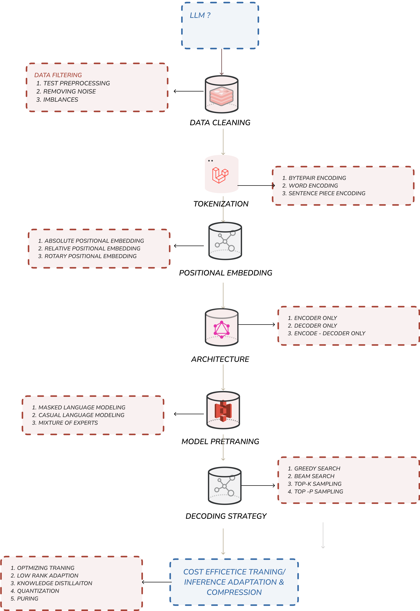
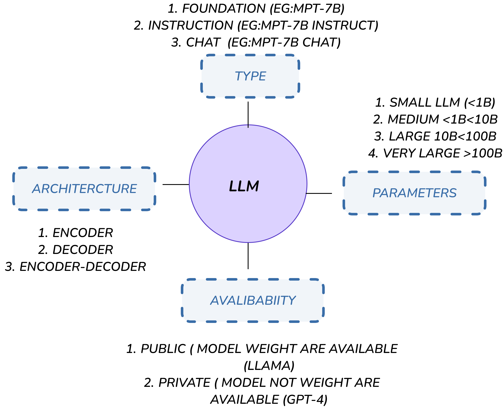
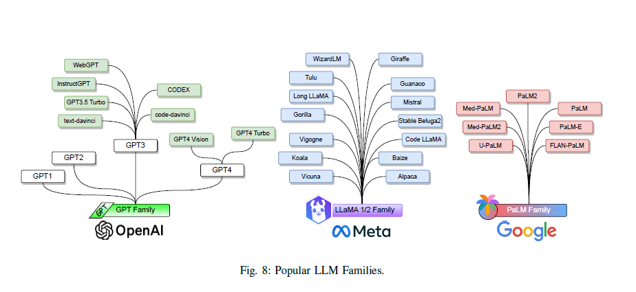

## LLM?

# LLM Models

### GPT Family Models

| Model Name | Family | #Parameters                                   | Release | Open Source | Type         | #Tokens | Training Dataset                                  | Architecture Explanation                                                                              |
| ---------- | ------ | --------------------------------------------- | ------- | ----------- | ------------ | ------- | ------------------------------------------------- | ----------------------------------------------------------------------------------------------------- |
| **GPT-1**  | GPT    | 120M                                          | 2018    | ✓           | Decoder-Only | 1.3B    | BooksCorpus                                       | **Transformer Decoder**: Unidirectional transformer predicting the next token based on context.       |
| **GPT-2**  | GPT    | 1.5B                                          | 2019    | ✓           | Decoder-Only | 10B     | Reddit outbound                                   | **Transformer Decoder**: Builds on GPT-1 with scalability and improved performance.                   |
| **GPT-3**  | GPT    | 125M, 350M, 760M, 1.3B, 2.7B, 6.7B, 13B, 175B | 2020    | ×           | Decoder-Only | 300B    | Common Crawl, WebText2, Books1, Books2, Wikipedia | **Transformer Decoder**: Scaled significantly from GPT-2, enhancing generation and understanding.     |
| **GPT-4**  | GPT    | 1.76T                                         | 2023    | ×           | Decoder-Only | 13T     | Proprietary                                       | **Transformer Decoder**: Advanced version of GPT-3 with larger capacity and more diverse training.    |
| **CODEX**  | GPT    | 12B                                           | 2021    | ✓           | Decoder-Only | -       | Public GitHub repositories                        | **Transformer Decoder**: Specialized GPT-3 variant fine-tuned on code and text for programming tasks. |
| **WebGPT** | GPT    | 760M, 13B, 175B                               | 2021    | ×           | Decoder-Only | -       | ELI5                                              | **Transformer Decoder**: Enhanced GPT-3 variant with real-time web retrieval capabilities.            |

## LLaMA Family Models

| Model Name     | Family | #Parameters       | Release | Open Source | Type         | #Tokens  | Training Dataset                                                             | Architecture Explanation                                                                               |
| -------------- | ------ | ----------------- | ------- | ----------- | ------------ | -------- | ---------------------------------------------------------------------------- | ------------------------------------------------------------------------------------------------------ |
| **LLaMA1**     | LLaMA  | 7B, 13B, 33B, 65B | 2023    | ✓           | Decoder-Only | 1T, 1.4T | Online sources                                                               | **Transformer Decoder**: Optimized for efficiency while maintaining competitive performance.           |
| **LLaMA2**     | LLaMA  | 7B, 13B, 34B, 70B | 2023    | ✓           | Decoder-Only | 2T       | Online sources                                                               | **Transformer Decoder**: Enhanced version of LLaMA1 with more scalability and diverse datasets.        |
| **LLaMA 3.1**  | LLaMA  | 7B, 13B, 65B      | 2024    | ✓           | Decoder-Only | 3T       | Web data, research papers, books, code repositories, conversational datasets | **Transformer Decoder**: Optimized for handling larger datasets and improving generation capabilities. |
| **Alpaca**     | LLaMA  | 7B                | 2023    | ✓           | Decoder-Only | -        | GPT-3.5                                                                      | **Transformer Decoder**: Fine-tuned LLaMA variant designed for conversational data generation.         |
| **Vicuna-13B** | LLaMA  | 13B               | 2023    | ✓           | Decoder-Only | -        | GPT-3.5                                                                      | **Transformer Decoder**: Fine-tuned LLaMA model optimized for dialogue tasks.                          |
| **Koala**      | LLaMA  | 13B               | 2023    | ✓           | Decoder-Only | -        | Dialogue data                                                                | **Transformer Decoder**: Fine-tuned for dialogue generation with natural and context-aware output.     |
| **Mistral-7B** | LLaMA  | 7.3B              | 2023    | ✓           | Decoder-Only | -        | -                                                                            | **Transformer Decoder**: Optimized for tasks requiring fewer parameters and text generation.           |
| **Code Llama** | LLaMA  | 34B               | 2023    | ✓           | Decoder-Only | 500B     | Publicly available code                                                      | **Transformer Decoder**: Specially fine-tuned for programming code tasks with LLaMA2 as the base.      |
| **LongLLaMA**  | LLaMA  | 3B, 7B            | 2023    | ✓           | Decoder-Only | 1T       | -                                                                            | **Transformer Decoder**: Optimized for handling long input sequences efficiently.                      |

## Palm Family Model

| Model Name     | Family | #Parameters   | Release | Open Source | Type         | #Tokens | Training Dataset                                             | Architecture Explanation                                                                                     |
| -------------- | ------ | ------------- | ------- | ----------- | ------------ | ------- | ------------------------------------------------------------ | ------------------------------------------------------------------------------------------------------------ |
| **PaLM**       | PaLM   | 8B, 62B, 540B | 2022    | ×           | Decoder-Only | 780B    | Web documents, books, Wikipedia, conversations, GitHub code  | **Transformer Decoder**: Designed for high scalability with extensive datasets for diverse tasks.            |
| **U-PaLM**     | PaLM   | 8B, 62B, 540B | 2022    | ×           | Decoder-Only | 1.3B    | Web documents, books, Wikipedia, conversations, GitHub code  | **Transformer Decoder**: Enhanced PaLM variant optimized for ultra-low precision and diverse tasks.          |
| **PaLM-2**     | PaLM   | 340B          | 2023    | ✓           | Decoder-Only | 3.6T    | Web documents, books, code, mathematics, conversational data | **Transformer Decoder**: Improved architecture with multilingual and coding capabilities.                    |
| **Med-PaLM**   | PaLM   | 540B          | 2022    | ×           | Decoder-Only | 780B    | HealthSearchQA, MedicationQA, LiveQA                         | **Transformer Decoder**: PaLM specialized in medical QA tasks, fine-tuned with healthcare-specific datasets. |
| **Med-PaLM 2** | PaLM 2 | -             | 2023    | ×           | Decoder-Only | -       | MedQA, MedMC                                                 | **Transformer Decoder**: Next-gen medical language model based on PaLM 2, fine-tuned for clinical data.      |

#### Evalutaion metric

| Benchmark Name                | Evaluation Metric                                                                               | Leaderboard                                                                     | Source                                                                      | paper with code                                                          |
| ----------------------------- | ----------------------------------------------------------------------------------------------- | ------------------------------------------------------------------------------- | --------------------------------------------------------------------------- | ------------------------------------------------------------------------ |
| HumanEval                     | PASS@k                                                                                          | [Link](https://llm-leaderboard.streamlit.app/)                                  | [Link](https://github.com/openai/human-eval)                                | [Link](https://paperswithcode.com/sota/code-generation-on-humaneval)     |
| MBPP                          | PASS@k, Accuracy                                                                                | -                                                                               | [Link](https://github.com/google-research/google-research/tree/master/mbpp) | [Link](https://paperswithcode.com/sota/code-generation-on-mbpp)          |
| APPS                          | PASS@k, Accuracy                                                                                | -                                                                               | [Link](https://github.com/hendrycks/apps)                                   | [Link](https://paperswithcode.com/sota/code-generation-on-apps)          |
| CoNaLa                        | BLEU                                                                                            | [Link](#)                                                                       | [Link](#)                                                                   | -                                                                        |
| CodeParrot                    | PASS@k                                                                                          | [Link](#)                                                                       | -                                                                           | -                                                                        |
| HellaSwag                     | Accuracy                                                                                        | [Link](https://huggingface.co/spaces/open-llm-leaderboard/open_llm_leaderboard) | [Link](https://rowanzellers.com/hellaswag/)                                 | [Link](https://paperswithcode.com/sota/sentence-completion-on-hellaswag) |
| AI2 Reasoning Challenge (ARC) | Accuracy                                                                                        | [Link](#)                                                                       | [Link](#)                                                                   | [Link](#)                                                                |
| BoolQ                         | Accuracy                                                                                        | -                                                                               | [Link](#)                                                                   | [Link](#)                                                                |
| MultiRC                       | F1-score, Accuracy                                                                              | -                                                                               | [Link](#)                                                                   | [Link](#)                                                                |
| CNN/Daily Mail [200]          | Accuracy                                                                                        | -                                                                               | [Link](#)                                                                   | -                                                                        |
| SQuAD                         | F1-score, EM                                                                                    | [Link](#)                                                                       | [Link](#)                                                                   | [Link](#)                                                                |
| RACE                          | Accuracy                                                                                        | -                                                                               | [Link](#)                                                                   | [Link](#)                                                                |
| CNN/Daily Mail [201]          | ROUGE                                                                                           | -                                                                               | [Link](#)                                                                   | [Link](#)                                                                |
| Drop                          | F1-score, EM                                                                                    | [Link](#)                                                                       | [Link](#)                                                                   | [Link](#)                                                                |
| QuAC                          | F1-score, HEQ-Q, HEQ-D                                                                          | [Link](#)                                                                       | [Link](#)                                                                   | [Link](#)                                                                |
| TriviaQA                      | EM, F1-score, Accuracy                                                                          | [Link](#)                                                                       | [Link](#)                                                                   | [Link](#)                                                                |
| Natural Questions             | EM, F1-score, Accuracy                                                                          | [Link](#)                                                                       | [Link](#)                                                                   | [Link](#)                                                                |
| StrategyQA                    | Accuracy, Recall@10, SARI                                                                       | [Link](#)                                                                       | [Link](#)                                                                   | [Link](#)                                                                |
| CoQA                          | F1-score                                                                                        | [Link](#)                                                                       | [Link](#)                                                                   | [Link](#)                                                                |
| XSum                          | ROUGE                                                                                           | -                                                                               | [Link](#)                                                                   | [Link](#)                                                                |
| SAMSum                        | ROUGE                                                                                           | -                                                                               | -                                                                           | [Link](#)                                                                |
| WikiSum                       | ROUGE                                                                                           | -                                                                               | [Link](#)                                                                   | -                                                                        |
| DialogSum                     | ROUGE                                                                                           | -                                                                               | [Link](#)                                                                   | [Link](#)                                                                |
| TruthfulQA                    | MC1, MC2, % true, % info, BLEURT                                                                | [Link](#)                                                                       | [Link](#)                                                                   | [Link](#)                                                                |
| MMLU                          | Accuracy                                                                                        | [Link](#)                                                                       | [Link](#)                                                                   | [Link](#)                                                                |
| GSM8K                         | Accuracy                                                                                        | [Link](#)                                                                       | [Link](#)                                                                   | [Link](#)                                                                |
| PIQA                          | Accuracy                                                                                        | [Link](#)                                                                       | [Link](#)                                                                   | [Link](#)                                                                |
| SIQA                          | Accuracy                                                                                        | [Link](#)                                                                       | [Link](#)                                                                   | [Link](#)                                                                |
| OpenBookQA (OBQA)             | Accuracy                                                                                        | [Link](#)                                                                       | [Link](#)                                                                   | [Link](#)                                                                |
| HotpotQA                      | EM, F1-score, Joint EM, Joint F1-score                                                          | [Link](#)                                                                       | [Link](#)                                                                   | [Link](#)                                                                |
| MATH                          | Accuracy                                                                                        | -                                                                               | [Link](#)                                                                   | [Link](#)                                                                |
| CommonsenseQA                 | Accuracy                                                                                        | [Link](#)                                                                       | [Link](#)                                                                   | [Link](#)                                                                |
| Natural Instructions          | ROUGE-L, Human                                                                                  | [Link](#)                                                                       | [Link](#)                                                                   | [Link](#)                                                                |
| BIG-bench                     | Accuracy, Average                                                                               | -                                                                               | [Link](#)                                                                   | [Link](#)                                                                |
| ToolTalk                      | Success rate, Precision, Recall, Incorrect action rate, Percent of failing error types          | -                                                                               | [Link](#)                                                                   | [Link](#)                                                                |
| MetaTool                      | Accuracy, Precision, Recall, F1-score                                                           | -                                                                               | [Link](#)                                                                   | [Link](#)                                                                |
| GPT4Tools                     | Success Rate of Thought, Action, Arguments, Overall Success                                     | -                                                                               | [Link](#)                                                                   | [Link](#)                                                                |
| API-Bank                      | Correctness, ROUGE, Error types (API Hallucination, Exceptions, Invalid Input Parameters, etc.) | -                                                                               | [Link](#)                                                                   | [Link](#)                                                                |
| Alpaca-CoT                    | -                                                                                               | -                                                                               | [Link](#)                                                                   | [Link](#)                                                                |

### LLM MODEL FAMILY

<!-- ## LLM Categories

| Model         | Size       | #Params (B) | Type       | Availability | Origin   |
| ------------- | ---------- | ----------- | ---------- | ------------ | -------- |
| GPT 3.5-turbo | Large      | 20          | Chat       | Unavailable  | Tuned    |
| Falcon 7B     | Medium     | 7           | Foundation | Public       | Original |
| Alpaca        | Large      | 13          | Chat       | Public       | Tuned    |
| Pythia 7B     | Medium     | 7           | Foundation | Public       | Original |
| Pythia 12B    | Large      | 12          | Foundation | Public       | Original |
| LLAMA 7B      | Medium     | 7           | Chat       | Public       | Original |
| LLAMA 2 7B    | Medium     | 7           | Chat       | Public       | Tuned    |
| LLAMA 2 7B    | Medium     | 7           | Foundation | Public       | Original |
| Vicuna 13B    | Large      | 13          | Foundation | Public       | Tuned    |
| Vicuna 7B     | Medium     | 7           | Foundation | Public       | Tuned    |
| Claude        | Large      | 93          | Chat       | Unavailable  | Original |
| Claude 2      | Very Large | 137         | Chat       | Unavailable  | Original | -->
